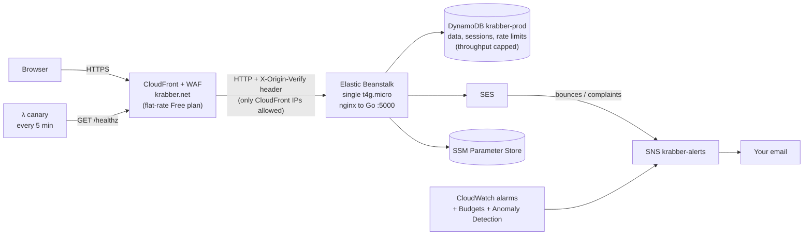

# Krabber.net Launch Plan (Elastic Beanstalk)

Status: **Draft for review** (v3, Beanstalk decided)
Region: **us-east-2 (Ohio)**. A few global pieces live in us-east-1 because AWS requires it (see [Region notes](#region-notes)).
AWS account: `381466680812` (fresh account; nothing from the old `700230361120` account is carried over)
Domain: `krabber.net` (registered through Route 53 on 2026-09-23; hosted zone `Z02627693RXH6QHSOUU5O`)
Repo: `github.com/t0ul/krabber-net`
Source codebase: **`krabber-net-main`** (the originally deployed app). `Krabber-net-API-master` was a separate, API-only version that has diverged, so it is **not** being ported. Nothing in this plan depends on it.

---

## 0. Decisions

| # | Decision | Choice |
|---|---|---|
| 1 | Hosting | **Elastic Beanstalk**, single `t4g.micro` instance, **CloudFront in front** for HTTPS |
| 2 | Edge pricing | **CloudFront flat-rate Free plan** ($0/month, includes WAF, DDoS protection, Route 53 DNS and TLS, **no overage charges**) |
| 3 | Cost principle | **The bill must have a known ceiling**, even under attack (section 2.2) |
| 4 | Sessions | **DynamoDB-backed session store** (sessions survive deploys and instance replacement) |
| 5 | Staging environment | **None on Beanstalk.** Local development covers it; staging arrives with the Lambda move. |
| 6 | Deploys | **Automatic on merge to `main`**, immutable (zero downtime, automatic rollback if the new instance is unhealthy) |
| 7 | Infrastructure | **Terraform** for everything except the one-time manual steps in section 3.1 |
| 8 | Rust | Optional, after the Lambda move (section 14) |

### Why Beanstalk instead of going straight to Lambda
- **The cost is fixed.** An instance costs the same idle or under attack. With CloudFront's flat-rate plan in front and the instance accepting traffic only from CloudFront, a flood can make the site slow but can't grow the bill (section 2.2). On Lambda, every request that reaches a Function URL or API Gateway is billed, even rejected ones, so it needs a kill switch and per-function concurrency limits.
- **Almost no rewrite.** `krabber-net-main` was built for Beanstalk (`Procfile`, `Buildfile`, HTTP server on port 5000). Background goroutines, the sea refresh ticker and trench fan-out work on one long-running process.
- **Launch in about a day instead of 5–6.** The account's Lambda concurrency quota is **10**, too low to reserve concurrency per function until AWS raises it.
- **What it costs:** about $8–10/month more than Lambda at hobby traffic, one instance as a single point of failure, and a plain-HTTP hop from CloudFront to the instance (section 1).

### What the account looks like (checked 2026-09-23)
- No DynamoDB tables, Beanstalk environments, S3 buckets, CloudFront distributions or SES identities. **There's no data to migrate.**
- **Paid account plan with $0 in credits.** Every charge goes to the card, so the cost guardrails in section 2 matter.
- **SES is in the sandbox:** 200 emails/day, 1 email/second, verified recipients only.
- **Lambda concurrency limit is 10.** Irrelevant for Beanstalk; only the small uptime canary (section 11) uses Lambda.
- `krabber.net` **now resolves** with the hosted zone's four `awsdns` nameservers.
- **Phase 0 done (2026-09-23):** root has MFA and no access keys; the root CLI profile is signed out and removed. IAM user **`t`** (`admin` group, `AdministratorAccess`) has MFA, no access keys, and is the only CLI identity (`--profile krabber-admin`, through `aws login`). IAM billing access is on, and Cost Explorer is enabled (data appears within about 24 hours). The stale `default` access key is deleted.
- Still missing, and handled by the Terraform bootstrap: account password policy, account alias, account-wide S3 Block Public Access, security contact. No AWS Organizations or Identity Center (not needed).

---

## 1. Architecture



### How a request flows
1. The browser connects over HTTPS to CloudFront (ACM certificate for `krabber.net` and `www.krabber.net`).
2. **WAF** (included in the plan) blocks obvious attacks and anyone exceeding the per-IP rate limits. Blocked requests don't count toward the plan's usage allowance.
3. `/static/*` is served from CloudFront's cache. On a cache miss, CloudFront fetches it from the app's embedded files. No S3 bucket is needed for assets.
4. Everything else goes to the Beanstalk environment's hostname over HTTP on port 80. CloudFront adds a secret `X-Origin-Verify` header and forwards all viewer headers, including `Host`, `CloudFront-Viewer-Address` (the real client IP), cookies and query strings.
5. The instance's security group accepts port 80 **only** from AWS's managed CloudFront IP list (`com.amazonaws.global.cloudfront.origin-facing`). The app also rejects any request without the correct secret header.

### Accepted risk: CloudFront to the instance is plain HTTP
A single-instance environment has no load balancer to hold an ACM certificate, so the hop from CloudFront to the instance is unencrypted and carries session cookies. It's mitigated by the CloudFront-only security group and the secret header, and AWS says CloudFront reaches AWS origins over its private network, but it isn't encrypted. Ways to remove it:
1. **Let's Encrypt on the instance** for an `origin.krabber.net` name (a `.platform` hook plus a renewal timer), with CloudFront connecting over HTTPS. About an hour of work; can be done right after launch.
2. **The Lambda move** (section 13): HTTPS end to end.
3. A load-balanced environment with an ALB (about $20 more per month) or CloudFront VPC origins (Business plan at $200/month). Not worth it at this size.

---

## 2. Cost

### 2.1 Normal month (us-east-2, hobby traffic)

| Item | Monthly |
|---|---|
| EC2 `t4g.micro` (2 vCPU, 1 GB), on demand | $6.13 |
| Public IPv4 (the single instance's Elastic IP) | $3.65 |
| EBS 8 GB gp3 root volume | $0.64 |
| CloudFront flat-rate **Free** plan: CDN, WAF (5 rules), DDoS protection, TLS, Route 53 hosted zone and queries, CloudFront log ingestion | $0 |
| DynamoDB on-demand + point-in-time recovery | $0.10–$1.00 |
| SES | about $0 ($0.10 per 1,000 emails) |
| CloudWatch Logs (14-day retention) + 8 alarms (first 10 free) | $0–$0.50 |
| Uptime canary Lambda (8,640 runs/month) | $0 (free tier) |
| S3 artifacts bucket, SSM standard parameters | about $0.02 |
| **Total** | **about $10.50–12/month** |

Immutable deploys briefly run a second instance for a few minutes, which costs pennies. The domain renewal (about $15/year) is billed yearly.

### 2.2 Worst case under attack (the ceiling)

| Layer | What caps it | Maximum extra cost |
|---|---|---|
| CloudFront, WAF, DNS | Flat-rate plan: no overage charges, and WAF-blocked requests don't count toward usage. Sustained excess over the 1M-request allowance can eventually slow delivery but never bills. | **$0** |
| Direct attacks on the instance's IP | The security group drops everything that isn't from CloudFront. Inbound data transfer is free. | **$0** |
| EC2 CPU | `t4g` "unlimited" credits bill $0.04 per vCPU-hour only when CPU stays above the 10% baseline. At 100% on both vCPUs all day that's the maximum. An alarm fires within an hour (section 11). | **≤ $0.08/hour (≤ $1.92/day)** |
| DynamoDB | On-demand **maximum throughput** caps on the table and every index (section 4.1). Requests above the cap are throttled, not billed. In practice a `t4g.micro` can't generate this much traffic. | **≤ about $5/day** at the caps |
| SES | The app refuses to send more than 500 emails/day (a DynamoDB counter), and the SES sandbox limit of 200/day applies until production access is approved | **≤ $0.05/day** |
| CloudWatch Logs | nginx access log turned off; app logs every error but only a 5% sample of successful requests; 14-day retention | a few cents/day |
| Data transfer out | Instance → CloudFront is free; CloudFront → viewers is covered by the plan | **$0** |

**Bottom line:** normally about $11/month. In the worst sustained attack, roughly $7/day more, with alarms firing within 15–60 minutes, a **daily budget alert**, and a manual **maintenance switch** (section 7.2) that blocks everything at WAF for $0.

---

## 3. Infrastructure

### 3.1 One-time manual steps (you)

| # | Step | Why |
|---|---|---|
| M1 ✅ | Enable **MFA on the root user**, then stop using root | Root can't be restricted by IAM policies |
| M1b ✅ | As root, turn on **"IAM user and role access to Billing information"** | Lets IAM user `t` use Budgets, Cost Explorer and billing |
| M2 ✅ | IAM user **`t`**: new password, **MFA** registered, `aws login --profile krabber-admin` | Every session is console sign-in with password + MFA; no access keys. Terraform bootstrap runs as this profile. |
| M3 ✅ | Delete the invalid `default` access key from `~/.aws/credentials` | Stops accidental use of stale credentials |
| M4 ✅ | Enable **Cost Explorer** | Cost Anomaly Detection needs it (data within about 24 hours) |
| M4b ✅ | Sign out the root CLI session and remove `[profile t]` from `~/.aws/config` | No root credentials left on the laptop |
| M5 | After Terraform creates the SES identity, **request SES production access** (use case "transactional signup and password reset emails", with the bounce handling in section 3.6) and verify your own address for testing | Until approved, only verified addresses receive email |
| M6 | Run `gh auth login`. Then, **if your GitHub plan allows it on a private repo** (Pro or higher), I create a `prod` environment limited to `main` and protect `main` (PR required, CI must pass). On GitHub Free, the deploy role's trust in `refs/heads/main` is the guard. | Deploys only happen from `main` |
| M7 | After the first prod apply, **subscribe the distribution to the Free plan** with one CLI command I'll provide (as `krabber-admin`) | CI is deliberately denied all pricing-plan changes so it can never move you to a paid tier (Pro is $15/month, Premium $1,000/month) |

`krabber.net` already resolves correctly, so the earlier DNS check is done.

### 3.2 Terraform layout and state

```
infra/
├── bootstrap/            # applied ONCE, locally, as IAM user t (profile krabber-admin)
├── modules/
│   ├── table/            # DynamoDB table, indexes, throughput caps, TTL, PITR
│   ├── beanstalk/        # EB app, env, roles, security group, artifacts bucket
│   ├── edge/             # CloudFront, WAF, ACM (us-east-1), Route 53 records, pricing plan
│   ├── email/            # SES identity, DKIM, MAIL FROM, DMARC, bounce handling
│   ├── config/           # SSM parameters
│   └── guardrails/       # SNS alerts, alarms, budgets, anomaly detection, canary Lambda
└── prod/                 # the only environment on Beanstalk
    ├── backend.tf  main.tf  variables.tf  outputs.tf  terraform.tfvars
```

- **Terraform** 1.10+ (native S3 state locking) with the **AWS provider v6**. Two provider blocks: `us-east-2` by default, plus an alias `us_east_1` for the ACM certificate, the WAF web ACL, CloudFront alarms and the pricing plan.
- **State** in S3 with `use_lockfile = true`. No DynamoDB lock table.
- **Tags** on everything: `project=krabber`, `env=prod`, `managed-by=terraform`.

### 3.3 Bootstrap stack (`infra/bootstrap`, applied once)

| Resource | Name | Details |
|---|---|---|
| S3 bucket (Terraform state) | `krabber-tfstate-381466680812` | Versioned, SSE-S3 encrypted, public access blocked, TLS-only policy, old versions expire after 90 days. **Only** IAM user `t`, `krabber-gha-plan` and `krabber-gha-deploy` can read it, because state contains generated secrets. |
| IAM OIDC provider | `token.actions.githubusercontent.com` | GitHub Actions gets short-lived AWS credentials; no stored keys |
| IAM role (plan) | `krabber-gha-plan` | Trust: pull requests on `t0ul/krabber-net` (GitHub doesn't issue OIDC tokens to fork PRs). `ReadOnlyAccess`, plus writing the state lock file and decrypting SSM SecureStrings. |
| IAM role (deploy) | `krabber-gha-deploy` | Trust: pushes to `main` (`ref:refs/heads/main`), or the `prod` environment if the repo has GitHub environments. The repo is **private**, and environments and branch protection on private repos need GitHub Pro. Manages only the services Krabber uses, with S3, DynamoDB, Lambda, SSM and SNS scoped to `krabber-*`. **Can't create or change IAM**: it can only pass the three workload roles below. Explicit denies on cost risks: EC2 launches other than `t4g.nano/micro/small`, NAT gateways, dedicated hosts, reservations, Spot, provisioned concurrency, SES dedicated IPs, **any CloudFront pricing-plan change**, and deleting or loosening the state bucket. |
| Workload roles | `krabber-eb-service`, `krabber-eb-instance` (+ instance profile), `krabber-canary` | Created here so CI never needs IAM write access. The instance role can only reach the `krabber-prod` table, send as `no-reply@krabber.net`, and read `/krabber/prod/*` parameters. |
| Account password policy | — | 14+ characters, all character classes, no reuse of the last 24; applies to IAM user `t` |
| Account alias | `krabber-net` | Sign-in URL becomes `https://krabber-net.signin.aws.amazon.com/console` |
| S3 Block Public Access (account-wide) | — | All four settings on, so no bucket in the account can ever be made public by mistake |
| Security alternate contact | your alert email | AWS sends abuse and security notices here, not only to the root email |

Bootstrap starts with local state, then moves its own state into the new bucket (`terraform init -migrate-state`).

### 3.4 Prod resources (`infra/prod`, applied by CI)

| Area | Resource | Settings |
|---|---|---|
| **Data** | DynamoDB table | `krabber-prod`; section 4 |
| **App** | S3 bucket (artifacts) | `krabber-artifacts-381466680812`; private, encrypted; app bundles and the canary zip; old objects expire after 30 days |
| | EB application | `krabber`; application version lifecycle keeps the latest 10 |
| | EB environment | `krabber-prod`; `EnvironmentType=SingleInstance`; solution stack chosen by regex "64bit Amazon Linux 2023 .* running Go 1"; `t4g.micro` (arm64) |
| | Security group | `krabber-eb-origin`: port 80 inbound **only** from the CloudFront origin-facing prefix list, nothing else. The prefix list counts as about 55 of the 60-rule limit, so this group holds nothing else. |
| | Default EB security group | **Disabled**: `aws:autoscaling:launchconfiguration` `DisableDefaultEC2SecurityGroup=true` with `SecurityGroups=krabber-eb-origin` |
| | Instance role + profile | `krabber-eb-instance`: DynamoDB CRUD on `krabber-prod` and its indexes; `ses:SendEmail` on the `krabber.net` identity and configuration set only; `ssm:GetParametersByPath` on `/krabber/prod/*`; decrypt with the AWS-managed SSM key; CloudWatch Logs write; the SSM Session Manager core policy (no SSH) |
| | EB service role | `krabber-eb-service` with the AWS-managed Beanstalk policies (enhanced health, managed updates) |
| | Deploys | `DeploymentPolicy=Immutable` and `RollingUpdateType=Immutable`: every deploy boots a fresh instance, switches only when it's healthy, and terminates it automatically if it isn't |
| | Instance settings | IMDSv1 disabled; no EC2 key pair; enhanced health; health check URL `/healthz`; managed platform updates weekly (minor + patch) in a Sunday-morning window; log streaming to CloudWatch with 14-day retention |
| | CPU credits | **`unlimited` (the `t4g` default), capped by an alarm.** `standard` mode would give every new instance zero launch credits, so immutable deploys and platform updates would boot at 10% CPU. The unlimited surcharge can't exceed $0.08/hour. If it's ever a problem, one `aws_ec2_default_credit_specification` resource switches the account to `standard`. |
| | Environment variables | Non-secret only: `APP_ENV=prod`, `AWS_REGION=us-east-2`, `TABLE_NAME=krabber-prod`, `SSM_PREFIX=/krabber/prod`, `BASE_URL=https://krabber.net` |
| **Edge** | ACM certificate (us-east-1) | `krabber.net` + `www.krabber.net`, DNS-validated |
| | WAF web ACL (us-east-1, CloudFront scope) | Required by the plan; exactly 5 rules (the Free plan's limit), listed in section 7.2 |
| | CloudFront distribution | HTTP/2 and HTTP/3; TLS 1.2+; aliases for apex and `www`; WAF attached. Only features the Free plan supports: managed cache and origin request policies, at most 5 cache behaviors, no real-time logs. |
| | Pricing plan | **Free** flat-rate subscription covering the distribution, the web ACL and the `krabber.net` hosted zone (so the $0.50 zone fee is covered too). **Created once by you (M7), not by Terraform in CI**, because the deploy role is denied pricing-plan writes. The distribution can't be deleted while subscribed. |
| | Behavior `/static/*` | Managed `CachingOptimized`; the app sends `Cache-Control: public, max-age=86400`, and the deploy pipeline invalidates `/static/*` after each release (one path; the first 1,000 invalidation paths a month are free) |
| | Default behavior | Managed `CachingDisabled` + managed `AllViewerAndCloudFrontHeaders-2022-06` origin request policy (forwards `Host`, cookies, query strings and `CloudFront-Viewer-Address`); all HTTP methods |
| | Origin | The Beanstalk environment hostname, HTTP only, custom header `X-Origin-Verify` from SSM |
| | Response headers | Managed `SecurityHeadersPolicy` as a backstop (custom response header policies need the Business plan). The **app** sets the full set: CSP, HSTS, `X-Frame-Options`, `Referrer-Policy`, `Permissions-Policy`, `nosniff` (section 7.4). Check during implementation that the managed policy doesn't override the app's headers. |
| | CloudFront Function | Redirects `www.krabber.net` to `krabber.net` (301). Functions can't be shared with another plan distribution. |
| | Route 53 records | Apex and `www` as A/AAAA aliases to CloudFront; **CAA** allowing `amazon.com` (plus `letsencrypt.org` if option 1 in section 1 is used) |
| **Email** | SES v2 domain identity | `krabber.net`, Easy DKIM (3 CNAMEs) |
| | Custom MAIL FROM | `mail.krabber.net` (MX + SPF) so SPF aligns with the sending domain |
| | DMARC | `_dmarc.krabber.net TXT "v=DMARC1; p=none; rua=mailto:<you>"`, then `p=quarantine` after two clean weeks |
| | Configuration set | `krabber-transactional`; bounce and complaint events to SNS; account-level suppression list on |
| **Config** | SSM parameters | `/krabber/prod/origin_verify_secret` and `origin_verify_secret_previous` (SecureString, generated by Terraform), `mail_from` (`Krabber <no-reply@krabber.net>`), `mail_daily_cap` (`500`), `contact_email`, `turnstile_site_key`, `turnstile_secret` (SecureString, set by you once) |
| **Guardrails** | SNS topic | `krabber-alerts` → your email |
| | Alarms | Section 11 |
| | Budgets | **Monthly** $15 (alerts at 80% actual, 100% actual, 100% forecast) and **daily** $1.50 (normal is about $0.37/day). The first two budgets are free. |
| | Cost Anomaly Detection | Service-level monitor with an immediate email subscription at a $3 impact threshold (free) |
| | Uptime canary | Lambda `krabber-canary` (Go, arm64, 128 MB), triggered every 5 minutes by EventBridge Scheduler. It requests `https://krabber.net/healthz` and `/crab/login` and fails if either isn't a 200 or the login page is missing its form. |

### Region notes
- **us-east-2:** DynamoDB, Beanstalk, EC2, S3, SES, SSM, the canary, most alarms and logs.
- **us-east-1 (AWS requirement):** the ACM certificate, the WAF web ACL (CloudFront scope), CloudFront metrics and alarms, and the pricing plan API.
- **Global:** CloudFront, Route 53, IAM and Budgets.

### 3.5 Who owns what
- **Terraform** owns all infrastructure, including the Beanstalk environment settings. It doesn't set `version_label`, so it never fights CI over which app version is running.
- **CI** owns app versions: build, upload to the artifacts bucket, create a Beanstalk application version, deploy it.
- **Secrets:** Terraform generates the origin secret. The Turnstile secret is a Terraform placeholder with `ignore_changes` on its value, set by you once with `aws ssm put-parameter`. No secret values appear in the repo.

### 3.6 Email bounce and complaint handling
1. SES bounce and complaint events go to `krabber-alerts`.
2. The account-level suppression list stops sending to addresses that bounced or complained.
3. Only transactional mail (activation, password reset, welcome), so no unsubscribe flow is needed yet.

---

## 4. DynamoDB

### 4.1 Table definition (replaces the Python script)

The old README's Python script creates a table named `krabber` in **us-west-2** with 10 GSIs at 1 RCU / 1 WCU each, while the code expects `krabber_prod`. Terraform creates this instead:

| Setting | Value | Why |
|---|---|---|
| Name | `krabber-prod` | Passed as `TABLE_NAME`; no hard-coded constant |
| Keys | `PK` (hash), `SK` (range), strings | Unchanged |
| GSIs | **GSI2, GSI3, GSI5, GSI6, GSI7, GSI8**, projection `ALL` (section 4.2). The list lives in `store.Indexes`, and `store.CreateTableInput` builds the same table for DynamoDB Local. | The port made GSI1 (crab by email) and GSI4 (comments on a molt) unnecessary: both are now base-table queries. GSI8 is a new sparse work-queue index. |
| Billing | `PAY_PER_REQUEST` | The old 1 WCU per index would throttle normal use |
| **Throughput caps** | Table: 50 reads/s, 10 writes/s. Each GSI: 25 reads/s, 10 writes/s. | The DynamoDB part of the cost ceiling (section 2.2). Normal use is 1–5/s. Raise the caps when traffic grows. |
| TTL | `expires_at` (epoch seconds) | Cleans up sessions, rate-limit counters and tokens |
| Point-in-time recovery | On (35 days) | Restore test in Phase 4 |
| Deletion protection | On | Guards against an accidental destroy |
| Streams | Off | Only needed in the Lambda phase |
| Encryption | AWS-owned key | Free |

### 4.2 Access patterns

As implemented in `internal/store/keys.go` (the single source for every key format). Generated IDs are KSUIDs with sub-second nanoseconds in the payload, so sorting by ID sorts by creation time.

| Entity | PK | SK | Index use |
|---|---|---|---|
| Crab (user) | `C#<email, lowercased>` | `C#` | GSI2 `ID#<id>` (by ID, list crabs). The email is the whole partition key, so a conditional put makes emails unique. |
| Username marker | `U#<username, lowercased>` | `U#` | — (written in the same transaction as the crab, so usernames are unique too) |
| Molt (post) | `M#<ownerCrabID>` | `M#<moltID>` | GSI3 `M#<yyyy-mm-dd, UTC>` / `M#<moltID>` (the day's molts, newest first, feeds the sea); GSI5 `M#<moltID>` (by ID) |
| Remolt marker | `RM#<crabID>` | `RM#<moltID>` | — (one remolt per crab per molt) |
| Comment | `MC#<moltID>` | `MC#<commentID>` | — (comments on a molt are a base-table query) |
| Like | `L#<crabID>` | `L#<moltID>` | GSI7 `L#<moltID>` (who liked a molt) |
| Follow | `F#<followerID>` | `F#<followeeID>` | GSI6 `F#<followeeID>` (followers of a crab) |
| Trench (feed) entry | `T#<crabID>` | `T#<moltID>` | — (stores the molt's key, so a feed page is one `BatchGetItem`; `expires_at` 90 days) |
| Sea cache shard | `MS#<0-4>` | `MS#<0-4>` | — |
| Token | `CT#<sha256 hex>` | `CT#<scope>` | — (`expires_at`; only the hash is stored) |
| **Session** | `S#<sha256 hex of session token>` | `S#` | — (`expires_at`) |
| **Rate-limit counter** | `RL#<action>#<key>` | `RL#<window start, Unix>` | — (`expires_at`; the email cap is action `mail`, key `daily`) |
| **Pending fan-out marker** | on the molt item | | GSI8 `Q#fanout` / `<moltID>` until fanned out, then the attributes are removed |
| **Report** (Phase 5) | `R#<moltID>` | `R#<reporterCrabID>` | GSI8 `Q#report` / `<time>` while open |

GSI8 is **sparse**: only items with a pending job carry `GSI8PK`, so it stays tiny and cheap to query. The table starts empty, so none of the key changes from the old code need a data migration.

---

## 5. Sessions in DynamoDB

The site keeps `alexedwards/scs`, with a custom `scs.Store` in `internal/store/sessions.go` in place of the in-memory default.

### 5.1 Item design
| Attribute | Value |
|---|---|
| `PK` | `S#` + SHA-256 of the session token. **The raw token is never stored**, so a table read or backup leak doesn't expose live sessions. |
| `SK` | `S#` |
| `data` | scs's encoded session data (binary) |
| `expires_at` | Unix seconds from scs's expiry; TTL cleanup only |
### 5.2 Rules that make it correct
1. **Check expiry on every read.** `Find` treats `expires_at <= now` as not found. TTL deletion can lag by up to about 48 hours, so it's cleanup, never the security check.
2. **Strongly consistent reads** (`ConsistentRead: true`) in `Find`, so the redirect right after login sees the session just written.
3. **Delete on token renewal.** `RenewToken` on login and logout (already in `crabs.go`) calls `Delete` on the old token. Tested explicitly.
4. **No idle timeout.** Fixed 12-hour lifetime (as today); scs only writes when session data changes, so page views don't cost writes.
5. **Log out everywhere.** The crab record gets `sessions_valid_after`; the session stores `authenticated_at` at login. `authenticate` rejects sessions where `authenticated_at < sessions_valid_after`. Password change, password reset and ban set it to now.
6. **Cheaper auth lookups.** The session stores the crab's `PK`/`SK`, so `authenticate` does one `GetItem` instead of today's GSI2 query on every request.
7. **Cookie settings** (currently scs defaults, which send the cookie over plain HTTP):
   - name `__Host-krabber_session` (forces Secure, Path `/`, no Domain)
   - `Secure`, `HttpOnly`, `SameSite=Lax`, `Path=/`, `Persist=true`
8. **Local development** (`APP_ENV=dev`) turns off `Secure` and the `__Host-` prefix, because localhost is HTTP.

### 5.3 Tests (required before launch)
- A session survives an app restart.
- An expired item is rejected even though it's still in the table.
- Login rotates the token, and the old token stops working.
- Logout clears the session; a password change logs out other sessions.
- A tampered or unknown token becomes an anonymous session, not an error.

---

## 6. Application changes

All work is a port of `krabber-net-main` into this repo.

### 6.1 Platform and configuration
| Change | Old location |
|---|---|
| Go 1.20 → **1.26** (toolchain pinned to **go1.26.8**; go1.26.0 had 23 standard-library vulnerabilities that `govulncheck` found reachable); current AWS SDK v2 and dependencies. `httprouter` and `alice` replaced by Go's own `ServeMux` and a small middleware chain. | `go.mod` |
| Module path `github.com/t0ul/krabber-net` | `go.mod` |
| Config from environment variables + SSM (`SSM_PREFIX`), validated at startup (fail fast). Remove `godotenv` in prod, the hard-coded `prod := false`, the `TableName` and `Crabmin` constants. | `application.go`, `internal/models/const.go` |
| AWS credentials from the **instance role**; remove static `DB_AKID`/`DB_SAC` | `createLocalClient` |
| Use the request `context.Context` in every AWS call (no `context.TODO()`) | `internal/models` |
| All dates in **UTC** explicitly (Lambda and EC2 default to UTC, but `time.Now()` without `.UTC()` depends on the machine) | `internal/models/molts.go`, `cmd/web/molts.go` |
| `GET /healthz`: returns 200. It **also requires the origin secret**. A localhost exception would be meaningless because nginx proxies every request from 127.0.0.1, and nothing needs it: a single-instance environment has no load-balancer health check, and the canary and smoke tests go through CloudFront. | new |
| JSON logs with `log/slog`: method, path, status, duration, viewer IP. Every 4xx/5xx is logged, but only 5% of successful requests. **Never** log query strings, tokens, passwords, emails or cookies. | `cmd/web/middleware.go` |
| Graceful shutdown on SIGTERM, draining background work (section 6.3) | `application.go` |

### 6.2 Email
| Change | Why |
|---|---|
| SMTP/Mailtrap → **SES v2 API** with the `krabber-transactional` configuration set | IAM-authenticated, no passwords |
| Send **synchronously** in the handler with a 5-second timeout, instead of `app.background(...)` | A goroutine mid-send is lost when the instance is replaced |
| **Daily send cap**: increment `RL#mail#<date>` before each send and refuse above `mail_daily_cap`. The refusal is logged, and a metric filter triggers an alarm. | Caps SES cost and protects sender reputation from email-bombing through signup |
| **Resend activation email** form on `/crab/activate` | Covers failed sends and the sandbox period |
| **Password reset**: request page → email with a single-use token (1-hour expiry) → set-new-password page, which sets `sessions_valid_after` | Users who forget their password are stuck today |

### 6.3 Background work on the instance
| Task | Approach |
|---|---|
| **Trench fan-out** | Posting a molt marks it pending (`GSI8PK=Q#fanout`) and hands it to an in-process worker, which writes the followers' trench entries with `BatchWriteItem` (25 per call, retrying unprocessed items with backoff) and then clears the marker. A ticker **every minute** picks up pending molts left over from a deploy or crash. The request returns immediately, however many followers the crab has, and the write cap (4.1) only slows fan-out, never the page. |
| **Sea refresh** (`FillSea`) | Ticker every 5 minutes with jitter, plus the admin "refresh now" button. Reads **today's and yesterday's** molts (UTC), so the sea isn't empty just after midnight. Idempotent. |
| **Emails** | Synchronous (6.2) |
| Shutdown | On SIGTERM, stop accepting new jobs and give in-flight fan-out up to 10 seconds; anything unfinished stays pending and the next instance's ticker finishes it |

### 6.4 Bugs found during review (fixed in the port)
1. **Login ignores `activated` and `banned`.** `crabLoginPost` never checks either. Fix: reject both with the generic message; `authenticate` treats banned crabs as logged out.
2. **Emails aren't normalized.** `C#<email>` as typed allows `Bob@x.com` and `bob@x.com` as two accounts. Fix: lowercase and trim everywhere.
3. **An unused auth token is created on every login** (`Tokens.New(crab, ScopeAuthentication)`, result discarded, never expires). Fix: remove.
4. **Remolts never reach the sea.** `moltRemoltPost` writes `GSI3PK` as an RFC3339 timestamp, but the sea reads by day (`cmd/web/molts.go`, around line 130). Fix: one key builder in `internal/store/keys.go`.
5. **`Sea()` ignores its `GetItem` error** and panics when a shard doesn't exist yet (`internal/models/seas.go`).
6. **The sea only reads the current day** (`latest()` in `internal/models/molts.go` queries only today's `GSI3PK`), so it goes empty at midnight. Fix: today and yesterday.
7. **Unfollow needs the followee's email** to update counters, as the code's own comment "need the email..." notes (`internal/models/follows.go`, around line 200). Verify in tests.
8. **The sea cache stores the whole molt list in one item.** DynamoDB items max out at 400 KB, so shards are capped at 100 molts.
9. **The "all crabs" page reads all of GSI2 at once.** Fine at launch; paginate before it grows.
10. **Data-changing POST routes check the session inside the handler** (like, remolt, comment, follow, unfollow). Fix: put them behind `requireAuthentication`.
11. **`authenticate` runs a GSI2 query on every request** just to check that the crab exists. Fix: `GetItem` with keys from the session (5.2 rule 6).

Found while porting (all fixed, most with a test):

12. **The authentication check always passed.** `Exists` queried GSI2 with `C#<id>`, a key that never exists, then returned `true` anyway, so any ID in a session counted as signed in.
13. **Emails weren't unique.** The crab key was `C#<email>` + `CU#<username>`, so the same email with a different username created a second account. **Usernames weren't unique either.** Fixed by the new keys in 4.2 plus the username marker.
14. **Activation tokens were stored in plain text** (`plaintext` attribute), which defeated hashing them.
15. **Tokens never expired and could be reused.** Expiry was never checked, the TTL attribute was a string (DynamoDB TTL ignores anything that isn't a number), and tokens weren't deleted after use. Now there's one atomic conditional delete per use.
16. **Token hashes were raw bytes formatted as strings** (`%s` on a SHA-256 array), which isn't valid UTF-8 in DynamoDB keys. They're hex now.
17. **Fan-out reached only the last page of followers.** Each page of the followers query overwrote the previous one.
18. **The sea and trench were in random order.** They sorted by UUID, not time. Now they sort by time-ordered KSUIDs.
19. **Two comments from the same crab in the same second collided** (the sort key was a second-resolution timestamp).
20. **Any missing record crashed the request** (`panic`, or indexing `[0]` of an empty result) in nearly every lookup.
21. **Molt authors were inconsistent**: one handler stored the username, the other the crab ID.
22. **The model validator never recorded errors** (`AddError` was a no-op), so the model-level validations never rejected anything.
23. **Activation was a 500** for any invalid token, and the activation email pointed at the old API (`PUT /v1/crabs/activated`) instead of the website.
24. **Liking or following twice returned a 500**; now it's a harmless no-op.
25. **Trench and sea pages made 50+ DynamoDB calls**, one per molt plus its comments. Now it's one query plus one batch read, and comments load only on the thread page.

### 6.5 Product and legal pages
| Page / feature | Notes |
|---|---|
| Privacy policy (`/privacy`) | Reuse `privacy-policy-url-com-main-2`: what's collected (email, username, posts), SES for email, no ads or tracking |
| Terms (`/terms`) | Acceptable use, termination for abuse |
| Account deletion (`POST /settings/delete`) ✅ | Asks for the password again. Deletes the crab's email and profile immediately (a tombstone keeps the username reserved), deletes their molts, likes, follows and trench entries in the background worker, and invalidates sessions. Details in `docs/NOTES.md` section 3.11. |
| Report a molt ✅ | Writes an `R#` item (GSI8 `Q#report`); `/crabmin/reports` lists open reports with remove, dismiss and ban-author actions. Details in `docs/NOTES.md` section 3.12. |
| Admin | A `role` attribute on the crab (`admin` or `moderator`) checked by `requireModerator`, replacing the hard-coded `Crabmin` ID. The first admin is set with `cmd/crabctl`; admins appoint moderators in Crabmin. See `docs/NOTES.md` section 3.9. |
| Maintenance page | `ui/static/maintenance.html`, shown by CloudFront's custom error response for **403**, which is what WAF returns when the maintenance switch is on (section 7.2). So the app itself **never returns 403**: CSRF rejections use 400 (set with `CrossOriginProtection`'s deny handler), missing auth redirects to login, and admin-only pages return 404. |
| `robots.txt`, `favicon.ico`, 404/500 pages | Small, but their absence shows in logs and browsers |

### 6.6 Housekeeping
- Don't carry over `.idea/` or `.DS_Store`; add them to `.gitignore`.
- The Beanstalk bundle is only `bin/application`, `Procfile` and `.platform/`. **No `.env`, no source code.**
- `.platform/nginx/conf.d/krabber.conf`: `access_log off` (Beanstalk's health agent uses its own log), `server_tokens off`, `client_max_body_size 64k`, sane timeouts.
- The old API repo (not ported) has hard-coded **Mailtrap credentials** in `Krabber-net-API-master/cmd/api/main.go`. Rotate them or close the Mailtrap account. The old README's AWS account ID isn't carried over.

---

## 7. Security

### 7.1 CSRF (layered)
1. **Go's `http.CrossOriginProtection`** (Go 1.25+) on all routes: rejects cross-site state-changing requests using the browser's `Sec-Fetch-Site` and `Origin` headers. `AddTrustedOrigin("https://krabber.net")` is set explicitly. CloudFront forwards the viewer `Host` here, but the Lambda move would break without it.
2. **`nosurf` tokens stay** for launch (already in every form, including htmx). Upgrade it and **test form posts through CloudFront**, not only localhost. Once layer 1 is proven, `nosurf` can go.
3. **Every data-changing action is a POST** (logout already is). No state-changing GETs.
4. The session cookie's `SameSite=Lax` is a passive third layer.

### 7.2 Abuse controls

**WAF web ACL: 5 rules (the Free plan's maximum), in priority order**

| # | Rule | Action |
|---|---|---|
| 1 | **Maintenance switch**: matches every request | Normally *Count* (does nothing). `make maintenance-on` flips it to *Block*, stopping all traffic at the edge for $0 while you investigate. `make maintenance-off` or any `terraform apply` puts it back. CloudFront shows the maintenance page for the resulting 403s. |
| 2 | Rate limit on auth paths: `/crab/login`, `/crab/signup`, `/crab/password*`, `/crab/resend` | Block above **20 requests per IP per 5 minutes** |
| 3 | Rate limit, all paths | Block above **500 requests per IP per 5 minutes** (a page is about 5 requests including assets) |
| 4 | AWS managed IP reputation list | Block |
| 5 | AWS managed common rule set | *Count* for the first week to check it doesn't break htmx posts, then *Block* |

Two checks during implementation: whether the Free plan allows a URI-path scope-down on rule 2 (if not, rule 2 becomes a lower global limit and the app-level limits below do the per-path work), and that the managed rule groups count as one rule each.

**In the app**

| Control | Design |
|---|---|
| Password hashing | bcrypt cost 12 (existing); passwords capped at 72 bytes in the validator (bcrypt silently truncates longer input) |
| Login throttling | DynamoDB fixed-window counters with TTL: 5 failures per email per 15 minutes, 20 attempts per IP per 15 minutes, then a generic "try again later". Also limits CPU spent on bcrypt. |
| Signup throttling | 3 signups per IP per hour |
| Bot protection | **Cloudflare Turnstile** (free) on signup, password reset and resend. (WAF CAPTCHA needs the Pro plan.) |
| Account enumeration | Login: "email or password is incorrect" (existing). Reset and resend: "if that account exists, we sent an email". Signup keeps "email already in use" at launch as an accepted risk. |
| Tokens | Stored as SHA-256 hashes (existing), single use, with expiry: activation 3 days, reset 1 hour |
| Admin | `requireModerator` + `role` on the crab |

### 7.3 Origin protection and client IP
- Security group: CloudFront's IP list only (3.4). App: **origin-verify middleware** rejects every request without the exact `X-Origin-Verify` value (constant-time compare) with a 404, `/healthz` included.
- Client IP comes from `CloudFront-Viewer-Address`, trusted **only** when the origin secret matched. `r.RemoteAddr` (CloudFront's address) is never used for rate limiting.
- **Secret rotation:** Terraform writes the new value and moves the old one to `origin_verify_secret_previous`; the app accepts both until the next rotation.

### 7.4 Browser hardening
- **Headers set by the app** on every response:

  ```
  Content-Security-Policy: default-src 'self'; script-src 'self'; style-src 'self' 'unsafe-inline'; img-src 'self' data:; font-src 'self'; connect-src 'self'; frame-src 'none'; form-action 'self'; frame-ancestors 'none'; base-uri 'none'; object-src 'none'
  Strict-Transport-Security: max-age=31536000; includeSubDomains
  X-Frame-Options: DENY
  X-Content-Type-Options: nosniff
  Referrer-Policy: strict-origin-when-cross-origin
  Permissions-Policy: camera=(), microphone=(), geolocation=(), payment=()
  ```

- When Turnstile keys are configured, `script-src` and `frame-src` also allow `https://challenges.cloudflare.com`. **Scripts are strict**: no inline scripts or `eval`. Styles allow `'unsafe-inline'` because the templates use inline `style` attributes; moving those into CSS is a later cleanup.
- Done in Phase 2 (and verified in a browser: zero CSP violations):
  - **`'unsafe-eval'` removed.** The `hx-on-htmx-after-request` handlers became `data-reset-on-success` attributes handled by `ui/static/js/app.js`; htmx is configured with `allowEval: false`, `allowScriptTags: false`, `selfRequestsOnly: true`.
  - **Dead inline handlers removed** from `view.html`: placeholder `onclick` menus calling functions that never existed, and forms with hard-coded molt IDs.
  - **Self-host fonts** instead of Google Fonts.
- **Upgrade htmx 1.x → 2.x** (blocks cross-origin requests by default). Re-test every `hx-post` form.
- `html/template` auto-escaping stays; never wrap user content in `template.HTML`.
- `Cache-Control: no-store` on every page that renders user-specific data.

### 7.5 AWS account
- Root with MFA, locked away; daily work as IAM user `t` with MFA and no access keys (M1, M2).
- GitHub → AWS through OIDC only; the deploy role can only be assumed from the `prod` environment on `main`.
- Least-privilege instance role; no SSH key pair; shell access only through SSM Session Manager.
- IMDSv2 only; managed platform updates on; all buckets private, encrypted and TLS-only.
- DynamoDB PITR and deletion protection, with one **restore test** in Phase 4.

### 7.6 Supply chain and pipeline
- GitHub Actions pinned to **commit SHAs**.
- **Dependabot** weekly for Go modules, Actions and Terraform providers.
- `govulncheck`, `golangci-lint` (with `gosec`) and `trivy config` on every PR.
- Workflow permissions default to `contents: read`; `id-token: write` only in jobs that talk to AWS.

---

## 8. Repository layout

```
krabber-net/
├── PLAN.md
├── README.md                       # run locally, deploy, runbooks
├── go.mod / go.sum                 # github.com/t0ul/krabber-net, Go 1.26
├── Makefile                        # dev, test, lint, build, bundle, tf-plan, maintenance-on/off
├── docker-compose.yaml             # DynamoDB Local
├── .golangci.yml
├── Procfile                        # web: bin/application
├── .platform/
│   └── nginx/conf.d/krabber.conf   # access_log off, server_tokens off, body size, timeouts
│
├── cmd/
│   ├── web/main.go                 # the website (Beanstalk)
│   ├── canary/main.go              # uptime canary Lambda
│   └── devseed/main.go             # dev only: create the table locally + sample crabs
│
├── internal/
│   ├── store/                      # all DynamoDB access; no HTTP knowledge
│   │   ├── store.go  keys.go       #   client + every key format in one place
│   │   ├── crabs.go  molts.go  comments.go  likes.go  remolts.go
│   │   ├── follows.go  trench.go  seas.go  tokens.go  reports.go
│   │   ├── sessions.go             #   scs.Store (section 5)
│   │   ├── ratelimit.go            #   fixed-window counters, mail cap
│   │   └── *_test.go               #   integration tests against DynamoDB Local
│   ├── web/
│   │   ├── routes.go  handlers_*.go  templates.go  forms.go
│   │   ├── middleware_security.go  #   origin verify, CSRF, headers, client IP
│   │   ├── middleware_auth.go      #   authenticate, requireAuthentication, requireModerator
│   │   ├── turnstile.go
│   │   └── *_test.go
│   ├── jobs/                       # fan-out worker, sea refresh and purge tickers
│   ├── mail/                       # templates + SES sender + daily cap
│   ├── config/                     # env + SSM loading and validation
│   ├── platform/                   # AWS SDK config, slog setup
│   ├── validator/  ksuid/          # carried over
│
├── ui/                             # embedded with //go:embed
│   ├── html/ (base, pages/, partials/)
│   └── static/ (css, js/htmx.min.js, js/app.js, fonts/, img/, maintenance.html)
│
├── infra/                          # section 3.2
│
└── .github/
    ├── dependabot.yml
    └── workflows/
        ├── ci.yml                  # pull requests
        └── deploy.yml              # merge to main
```

---

## 9. CI/CD (GitHub Actions)

### `ci.yml`: every pull request
1. `gofmt` check, `go vet`, `golangci-lint` (with `gosec`)
2. `go test ./...` including integration tests against DynamoDB Local (service container)
3. `govulncheck ./...`
4. Build both binaries for Linux arm64: `CGO_ENABLED=0 GOOS=linux GOARCH=arm64 go build -trimpath -ldflags="-s -w"` for `./cmd/web` (→ `bin/application`) and `./cmd/canary` (→ `bootstrap`, `-tags lambda.norpc`)
5. `terraform fmt -check`, `validate`, `tflint`, `trivy config infra/`
6. `terraform plan` for `infra/prod` with the `krabber-gha-plan` role, posted as a PR comment

### `deploy.yml`: merge to `main`
1. Repeat checks 1–4.
2. Assume `krabber-gha-deploy` through OIDC (`prod` environment).
3. Upload the canary zip, then `terraform apply` for `infra/prod` (a no-op when nothing under `infra/` or the canary changed).
4. Bundle `bin/application` + `Procfile` + `.platform/` as `krabber-<git-sha>.zip` and upload it to the artifacts bucket.
5. `aws elasticbeanstalk create-application-version --version-label <git-sha> --process`
6. `aws elasticbeanstalk update-environment --environment-name krabber-prod --version-label <git-sha>`, then `wait environment-updated`. The deploy is **immutable**: Beanstalk boots a new instance, switches only when it's healthy, and throws it away if it isn't. That takes about 5–8 minutes, with no downtime.
7. Smoke test through CloudFront: `/healthz` 200, `/` 200, `/crab/login` renders its form.
8. If the smoke test fails, **redeploy the previous version label automatically** and fail the workflow.

`concurrency: deploy-prod` so only one deploy runs at a time.

### Rollback and runbooks (in README)
- **App:** `aws elasticbeanstalk update-environment --environment-name krabber-prod --version-label <previous-sha>` (the last 10 versions are kept).
- **Infrastructure:** `git revert` the Terraform change; the pipeline re-applies.
- **Under attack:** `make maintenance-on`, investigate, `make maintenance-off`.

---

## 10. Local development
- `make dev`: starts DynamoDB Local, creates the table with the same schema as Terraform plus three activated sample crabs (`cmd/devseed`), and runs the site on `http://localhost:5050` with `APP_ENV=dev`. Port 5050 because macOS's AirPlay Receiver holds 5000; Beanstalk still uses 5000.
- In dev: origin-verify off, cookie `Secure` off, Turnstile uses Cloudflare's always-pass test keys, and emails print to the console instead of going to SES.
- `make test` runs everything CI runs.

---

## 11. Observability and alarms

All alarms notify `krabber-alerts` (your email). Eight alarms, within the 10 free.

| Alarm | Condition | Why |
|---|---|---|
| Canary failing | `krabber-canary` errors in 2 of 3 runs (10 minutes) | End-to-end check through DNS, TLS, CloudFront, WAF and the app |
| Beanstalk health | Environment health Degraded or Severe for 5 minutes | The instance or app is unhealthy |
| **CPU surplus charges** | `CPUSurplusCreditsCharged` > 0 for 1 hour | The unlimited-credit surcharge (≤ $0.08/hour) has started |
| DynamoDB throttling | `ThrottledRequests` > 0 for 15 minutes | Hitting the caps: either an attack or time to raise them |
| CloudFront 5xx | `5xxErrorRate` > 5% for 10 minutes (us-east-1) | The origin is failing behind CloudFront |
| SES bounce rate | > 4% | Well below AWS's review level |
| SES complaint rate | > 0.08% | Well below AWS's review level |
| Email cap reached | Metric filter on the app's "mail cap reached" log line | Someone may be abusing signup or reset |

Also:
- **Budgets:** $1.50/day and $15/month (section 3.4), plus **Cost Anomaly Detection**.
- **Why not a Route 53 health check:** its many checkers would send more than a million requests a month through CloudFront, which is more than the Free plan's allowance. The canary sends about 17,000.
- **Logs:** app JSON logs in CloudWatch (14 days), queryable with Logs Insights.

---

## 12. Phases and schedule

| Phase | What | Who | Estimate |
|---|---|---|---|
| **0. Account** ✅ | M1–M4b: root MFA, billing access for IAM, IAM user `t` with MFA + `aws login`, Cost Explorer, remove root CLI profile | Done 2026-09-23 | — |
| **1. Bootstrap** ✅ (except M6) | `infra/bootstrap` applied 2026-09-23 (29 resources: state bucket, OIDC, CI roles, workload roles, account settings); its state migrated to `s3://krabber-tfstate-381466680812/bootstrap/terraform.tfstate`. Still open: M6 (`gh auth login`, GitHub environment and branch protection if your plan allows), and the security contact once you give a phone number. | Done | — |
| **2. App port + security** ✅ | Done 2026-09-23. Repo layout, Go 1.26.8, `internal/store`, DynamoDB sessions, config (env + SSM), SES + daily cap, background jobs, the bugs in section 6.4, section 7 app controls, tests (store, sessions, web flows over HTTPS, jobs, config, mail), local dev. `golangci-lint`: 0 issues; `govulncheck`: 0 affecting. Moved to Phase 5: password reset UI and reports. | Done | — |
| **3. Infra + pipeline** | `infra/prod` modules including WAF, the Free plan subscription and guardrails; `ci.yml`/`deploy.yml`; first deploy; certificate and SES identity verified; submit M5 (SES production access) | Me; you review the first plan | 0.5 day |
| **4. Launch checks** | Through `https://krabber.net`: signup → activation → login → post → follow → trench → sea; CSRF and rate limits; maintenance switch on and off; table restore test; each alarm fired once to confirm the email arrives | Together | 2–3 hours |
| **5. Product and legal** | Privacy, terms, account deletion, reports and bans, password reset UI, error and maintenance pages. Runs together with P1 of [`docs/NOTES.md`](docs/NOTES.md) (delete molt, notifications, settings, block). | Me | 0.5–1 day (2–3 with P1) |
| **6. Origin TLS** (soon after launch) | Let's Encrypt on the instance, CloudFront to origin over HTTPS (section 1) | Me | 1–2 hours |

**Timing:** live on `https://krabber.net` at the end of the first long day (Phases 0–4) if nothing surprising comes up. Public signups wait for **SES production access** (usually about a day after M5). Finish Phase 5 before inviting people.

---

## 13. Later: moving to Lambda

The stateless design (sessions in DynamoDB, config from SSM, background jobs recoverable from DynamoDB markers) is what keeps this a deployment change. What was learned while planning:

| Topic | Finding |
|---|---|
| Front door | **CloudFront → Lambda Function URLs (auth type `NONE`) + the same `X-Origin-Verify` check**, with no API Gateway. API Gateway bills requests it throttles, while Lambda doesn't bill throttled invocations, so reserved concurrency becomes a hard cost cap. (Function URLs with origin access control need a body hash header on POSTs, which HTML forms can't send, so that option is out.) |
| Permissions | Function URLs created since October 2025 need both `lambda:InvokeFunctionUrl` and `lambda:InvokeFunction` |
| Headers | CloudFront must use `AllViewerExceptHostHeader`, so the app sees the Function URL's host: `AddTrustedOrigin("https://krabber.net")` becomes required |
| Concurrency | Request the account quota increase (currently 10) first; give every function a reserved-concurrency cap |
| Functions | `web` (pages), `auth` (bcrypt routes, more memory, lower cap), `trench-fanout` (DynamoDB Stream), `mailer` (outbox items on the stream), `sea-refresh` and `account-purge` (EventBridge Scheduler), `canary` (already exists) |
| Kill switch | Alarm → flips the WAF maintenance rule and sets `web`/`auth` concurrency to 0 |
| Environments | Staging added here on `staging.krabber.net` (a second Free plan; up to 3 per account) |
| Cost | About $1–3/month normally |

---

## 14. Optional: Rust

For the theme, not for cost. Port after the Lambda move, one function at a time with `cargo-lambda`: canary → sea refresh → fan-out → mailer → web last (templates to Askama, sessions and CSRF reimplemented). About 1–3 weeks. Functions can switch languages independently because they share only the table and the key formats in section 4.2.

---

## 15. Open questions
1. **Alert email address** for alarms, budgets, bounces and DMARC reports.
2. **Turnstile:** OK to add Cloudflare Turnstile to signup and reset?
3. **HSTS preload:** submit `krabber.net` to the browser preload list after a clean week? It's hard to undo.
4. **CloudFront Pro plan ($15/month) later?** It adds WAF CAPTCHA, header-based rules and custom response header policies. Not needed for launch.
